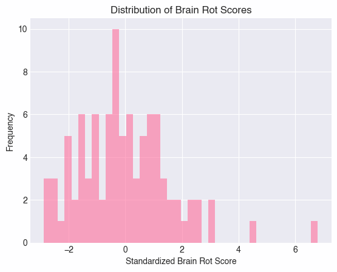
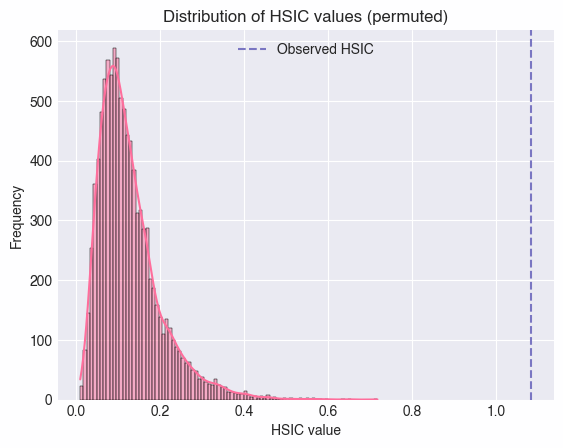

# Using Information Theory to determine which Features affect Brainrot among students

## Are There Any Characteristics Amongst High Schoolers that Affect Brain Health?
Nathan Jeon, Julian Ng-Thow-Hing, Thomas Flament, Daniel Matsui Smola

## Abstract:
Our generation has been plagued by a phenomenon referred to as brain rot. This statistical survey was conducted to find associations between brain rot and various characteristics such as race and gender and the number of Instagram followers the subject had. We hypothesized that there was a positive correlation between brain rot and high schooler characteristics. We sampled random high schoolers at Homestead High School and asked them a series of characteristic questions, which consisted of the few mentioned beforehand. Afterward, we surveyed the subject on a sequence of questions that would be used to assess brain rot. This quiz was constructed from various internet memes, which the subject was asked to identify. Their response was recorded in terms of correct or incorrect. Finally, after the questions, the subjects were asked to watch a video, and their attention time in terms of time spent watching was recorded. Brain rot scores were standardized using z-scores, and relationships between high schooler characteristics were measured using a kernel statistical test for independence. After our calculations, we found significant evidence with an HSIC value of 0.0045 and p-value of 0.0009 to suggest a relationship between at least one of the variables recorded and brain rot. Ultimately, our results supported the hypothesis that brain rot is a measurable variable associated with at least one of the high schooler characteristics we collected. With feature selection, we further concluded that knowing the amount of Instagram followers someone had was most helpful in determining their brain rot score. From this experiment, we have expanded our knowledge of the phenomenon of brain rot. We hope to find deeper connections between each categorical variable and levels of brain rot to prevent the brain rot epidemic from expanding in the future.

## Introduction:
The purpose of this project is to analyze brain rot, a phenomenon common amongst young adults and teenagers that refers to a decrease in brain function as a result of spending too much time on TikTok, Instagram, and other social media platforms. The present study will help determine if specific characteristics amongst high schoolers, such as race, gender, and the amount of Instagram followers they have, are associated with higher levels of brain rot. We tested for brain rot with different questions and an attention span video test to measure the amount of brain rot a person exhibits. 

Let **X** be the distribution of features [*"Asian", "Black/Hispanic", "Indian", "White", "Female", "Male", "Freshmen", "Junior", "Senior", "Sophomore", "Android", "iPhone", "Brawl", "Not Brawl", "STEM", "not STEM", "Band/Orchestra/CG", "not in Music", "Instagram"*] amongst the sampled students.  
Let **Y** be the distribution of “Standardized Brain Rot Score” of the sampled students.

### Hypothesis:
`HO: Pxy = PxPy`  
The Kullback–Leibler divergence is equal to 0.  
In other words, there is **NO** association between the various features amongst Homestead High School students and levels of brain rot as determined by the calculated brain rot score.  

`HA:  Pxy ≠ PxPy`  
There **IS** an association between the various features amongst Homestead High School students and levels of brain rot as determined by the calculated brain rot score.

### Definitions of Terms:
- **Brain rot:** A condition of a lack of mental clarity, typically accompanied with lowered attention span and cognitive decline as a result of excessive screen time.   
- **Brawl Stars:** An online multiplayer fighting game released by Supercell.  
- **STEM:** Science, Technology, Engineering, Math

### Assumptions:
- People own either an Apple or Android phone  
- The classification of music programs includes marching band, concert band, wind ensemble, orchestra, chamber orchestra, choir, and color guard.  
- If a subject did not have Instagram installed, they would be considered to have 0 Instagram followers  

### Limitations and Delimitations:
- Limitations:  
  - We cannot determine whether subjects are lying about the number of Instagram followers they truly have.  
    - Some users may have alternate accounts, which is not an accurate representation of the total number of Instagram followers they have.  
  - We cannot ethically determine whether subjects are lying about their intended field of study for college.  
  - There are limits to the repetitiveness of the video portion of our survey. The sheer amount of environmental factors made it impossible to provide each subject with a similar experience.  
- Delimitations:
  - Length of the video used in the latter portion of the brain rot quiz was kept at a maximum of 3 minutes. 

## Review of Literature:
There is no prior literature on assessing the possibility of a correlation between various high schooler characteristics and brain rot. Our study uses variables that have not been assessed for, apart from race and gender. However, it is important to note that there have been many counts of previous literature that have investigated the relationship between screen time and brain rot.
 
## Methodology: 
### Data Collection:
#### Participants:
Our participants were students from Homestead High School, which ranged from all races, grades, and genders. We ensured each participant was comfortable with taking part in the survey before proceeding further.  
#### Instruments:
- Spinner  
  - Used to determine subjects on a random basis  
- Personally created brain rot quiz including a series of pictures and a video  
  - Used as data to calculate the brain rot score of each individual
Google Sheets  
- Used to collect, track, and analyze data quickly  
  - Computer, a phone, and a timer  
- All used simultaneously to conduct the brain rot quizzes  
#### Procedure:
- Spin the spinner with random amounts of force and survey the first person the arrow points to  
- In this specific order, survey the subject on their name, race, gender, grade, whether they use an iPhone or Android, whether they play Brawl Stars, whether they plan to pursue STEM in college, the number of Instagram followers they currently have, and whether they are a part of the music program.  
- Showcase the brain rot quiz and ask the individual these specific questions with their designated photos and record whether or not they were correct:  
  - **What is this?** (TikTok Rizz Party)  
  - **What pop culture reference is this?** (Lebonbon or “You are my Sunshine”)  
  - **Who is this?** (Caseoh or 1 by 1 lego brick)  
  - **What series is this from?** (Skibidi Toilet or Cameraman)  
  - **Complete this sentence** (Sigma)  
  - **Which of the following pets were leaked in Drake’s most recent video?** (Snake)  
- Prepare the brain rot video and a timer  
  - Hand the subject the phone and instruct them to:  
    - “Press play whenever you are ready”  
  - Carefully examine the subject:  
    - Keep note of the time whenever they ask if the video is a loop or continuously stare back at you. This is a sign of a reconnection of consciousness from the video.  
    - However, if the subject continues to watch the video, record the last time they completely stop.  
    - It is up to the analyzer to determine whether or not the subject is officially “done” watching the video.  
    - If outside variables affect the subject’s performance, mark the time as “tainted,” as it may or may not be used for future calculations.  
- Thank the subject for their time and data.  
### Process Data:
- **Cleaning features**  
  - Considered those who were half white (including wasians) as white, and half black as black.  
  - Combined Hispanics/Latinos and Blacks into one category Black/Hispanic.  
  - Considered Orchestra, Band, Color Guard and Choir as part of Homestead Music Program.  
  - Individuals with tainted watch times were dropped from the dataset.   
- **Preparing features**  
  - Take the logarithm of the number of instagram followers students have + 1  
  - Horizontally stack the one-hot encoded categorical features and standardized numerical features, resulting in 19 features (from the initial 8)  
    - [*"Asian", "Black/Hispanic", "Indian", "White", "Female", "Male", "Freshmen", "Junior", "Senior", "Sophomore", "Android", "iPhone", "Brawl", "Not Brawl", "STEM", "not STEM", "Band/Orchestra/CG", "not in Music", "Instagram"*]  
- **Calculating brain rot score**  
  - Convert responses to the 6 questions into binary on whether the respondents answered correctly or incorrectly.  
  - Calculate the cumulative score on the quiz for each respondent by first taking the mean of the log likelihood for each response of every feature. Then take the weighted sum of the questions answered correctly (0 incorrect, 1 correct) with the weights being 1/p where p is the probability of answering each question correctly, which is calculated by exponentiating the log likelihood for each feature.  
  - Standardize the cumulative quiz scores.  
  - Standardize the amount of time each respondent spent watching the brain rot video.  
  - Take the sum of the standardized quiz scores and standardized watch times to obtain the brain rot score of each individual.  
  -    
### Hilbert-Schmidt Independence Criterion Test:
- **Apply Kernel Functions (rbf, linear, and poly) for both the combined features and the brain rot scores.**  
  - Sklearn’s pairwise_kernels was used for this  
- **Calculate HSIC statistic using kernel matrices**  
  - Compute Gram matrices of X and Y (K and L)  
  - Center K and L to eliminate influence of mean (where H is the centering matrix)  
  - Calculate trace of K and L (This is KHLH)  
  - This computes the sum of the squares of the Pearson Correlation coefficients when using linear kernels  
  - Divide this by n squared to compute HSIC statistic  
- **Significance Testing**  
  - Permutation testing where we shuffle Y 10000 different times to build a distribution of HSIC under null hypothesis. The p-value would be the proportion of HSIC values greater than the observed value.  
### Feature Selection: 
- **Backward Elimination (BAHSIC):**  
  - Iteratively remove features that contribute least to the HSIC statistic by calculating HSIC statistic with said feature removed from the list, and then dropping the feature with the largest HSIC statistic (as the absence of said feature reduced HSIC the least).  
### Bonferroni Correction: 
- In order to counteract the effects of multiple comparison problems, implement Bonferroni Correction.  
- Total of 6 hypotheses  
  - 3 (rbf, linear, poly kernel) with raw number of instagram followers  
  - 3 (rbf, linear, poly kernel) with number of instagram followers adjusted with logarithm.  
- Significance for each hypothesis alpha / 6 => 0.05 / 6 = 0.008  
## Results:  
- **Hilbert-Schmidt Independence Criterion Test:**  
  - **Kernel rbf**  
    - HSIC value: 0.004521337534164431  
    - P-value: 0.0009  
  - **Kernel linear**  
    - HSIC value: 0.35218021513830816  
    - P-value: 0.007  
  - **Kernel poly**  
    - HSIC value: 19.29296405224944  
    - P-value: 0.1487  
  -   
- **Feature Selection**  
  - Ordered feature names (from most to least important): ['Instagram', 'STEM', 'not STEM', 'Senior', 'Brawl', 'Not Brawl', 'Asian', 'Band/Orchestra/CG', 'not in Music', 'Female', 'Male', 'Junior', 'Indian', 'Black/Hispanic', 'Sophomore', 'Android', 'iPhone', 'White', 'Freshmen']  
## Conclusion:
- Since a P-value of 0.0009 is less than an alpha / 6 of 0.008, we can reject the null hypothesis, and there is an association between the features X with student’s brain rot scores.  
- The significance of features in determining the brain rot of a student in order of importance was the number of followers they had on Instagram, whether or not they planned on doing STEM in college, were a Senior, played Brawl stars, were Asian, were in a Music Program, were Female, have an iPhone.  
  - Greater number of instagram followers => more time spent on phone, watching reels or brain rot.  
  - STEM students => More studious and less time spent consuming brain rot content  
  - Senior => More versed in online brain rot culture as more mature  
  - Brawl Stars => Brain rot game  
  - Asian => ???  
## Recommendations:  
- Use Maximum Mean Discrepancy rather than HSIC  
- Get a more diverse data set.  
- Collect more features.  
- Differ methods of calculating brain rot.  
